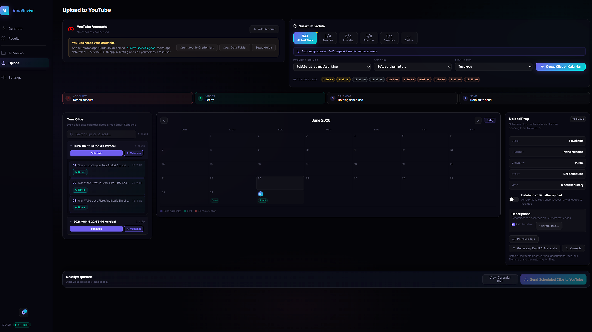
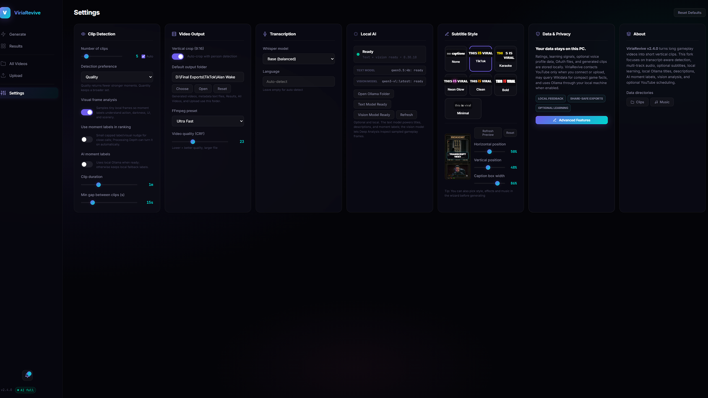
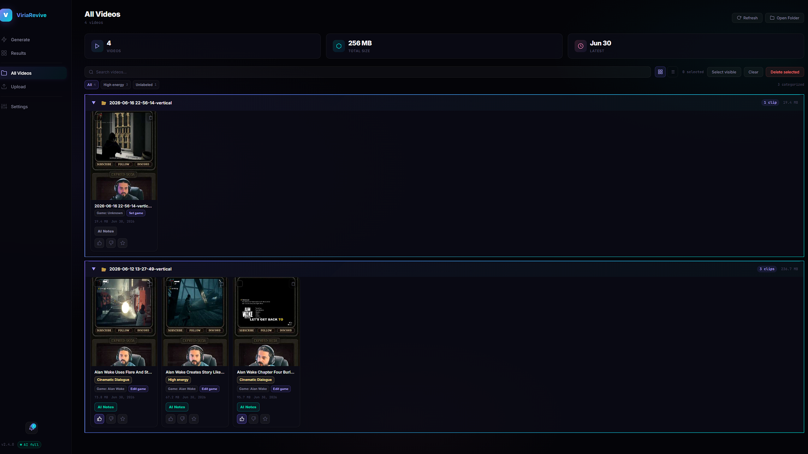
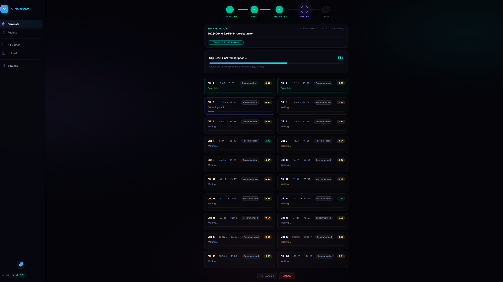

<p align="center">
  
  
  
  
  
</p>

<h1 align="center">
  ViriaRevive
  <br>
  <sub><sup>A video-game focused clipping studio for creators.</sup></sub>
</h1>

<p align="center">
  ViriaRevive is a Windows-first fork built for gameplay creators. It turns long
  recordings, streams, and YouTube gameplay videos into Shorts-ready clips and
  montages with local analysis, optional local AI, subtitles, metadata, and
  upload preparation.
</p>

<p align="center">
  <strong>Current version: v2.4.0</strong>
</p>

<p align="center">
  
</p>

<p align="center">
  <em>Actual ViriaRevive v2.4.0 desktop screenshots.</em>
</p>

<table>
  <tr>
    <td width="50%">
      
    </td>
    <td width="50%">
      
    </td>
  </tr>
  <tr>
    <td align="center"><strong>Upload scheduling and AI metadata prep</strong></td>
    <td align="center"><strong>Local AI, privacy, subtitles, and output settings</strong></td>
  </tr>
  <tr>
    <td width="50%">
      
    </td>
    <td width="50%">
      
    </td>
  </tr>
  <tr>
    <td align="center"><strong>All Videos library with clip learning controls</strong></td>
    <td align="center"><strong>Generation progress and candidate scoring</strong></td>
  </tr>
</table>

---

## What This Fork Is

ViriaRevive is a **video-game focused clipping app**. It is designed around the
messy reality of gaming footage: long sessions, separate microphone and game
audio, NPC dialogue, quiet story beats, sudden chaos, deaths, tutorials,
cutscenes, and creator reactions that are easy to miss in a normal editor.

This fork keeps the original open-source foundation and pushes it toward a
creator workflow for gameplay Shorts, TikToks, YouTube clips, and stitched
montage highlights.

Use it when you want to:

- Find good moments in long gameplay recordings without scrubbing for hours.
- Keep creator commentary separate from game/NPC audio when possible.
- Generate vertical clips, subtitles, titles, descriptions, hashtags, and tags.
- Build multi-beat gameplay montages from related moments.
- Let local feedback, game context, voice profile data, and optional Ollama AI
  improve future ranking over time.
- Prepare clips for manual posting or optional YouTube scheduling.

---

## Highlights

- **Gameplay-first detection:** ranks moments using speech, audio intensity,
  scene changes, visual motion, game context, category labels, and creator
  feedback.
- **Short Clips and Montage modes:** create single highlight clips or 1-5
  stitched gameplay montages from the same analysis pass.
- **Multi-track audio aware:** final clips keep the full game/mic mix while
  subtitles and metadata can focus on the commentary track.
- **Local AI optional:** Ollama can improve titles, descriptions, labels, and
  Deep Analysis vision-frame context without sending videos to a cloud service.
- **Game-aware metadata:** optional game hints, filename/YouTube metadata, and
  compact Wikidata facts help titles and descriptions stay grounded.
- **Learning loop:** likes, dislikes, favorites, reasons, deleted clips, montage
  outcomes, and timing history stay local and can nudge future results.
- **Creator-friendly output:** vertical video, subtitle placement, sidecar
  `.txt` metadata, thumbnails, preview cards, and optional YouTube upload prep.

---

## Feature Tour

### Find Better Moments

- Choose **Fast**, **Balanced**, or **Deep Analysis** depending on how much time
  you want the app to spend looking.
  - **Fast** keeps heavier AI/vision passes off so quick batches finish sooner.
  - **Balanced** uses stronger transcript, scene, and label ranking without the
    full vision-model pass.
  - **Deep Analysis** inspects more candidates, can use local vision context
    when Ollama's vision model is ready, and gives quieter funny, sarcastic,
    chaotic, story, or explainer commentary room to rank without needing loud
    panic keywords.
- Uses audio peaks, scene signals, transcript quality, category labels, and
  local feedback to rank clips.
- In **Deep Analysis**, can use an installed local Ollama vision model to inspect
  sampled frames so rankings and metadata are grounded in what is actually on
  screen. Close near-misses can be rescued when transcript quality is just under
  the bar but the frames show a strong visual moment.
- Resolves likely game identity from source names, YouTube metadata, and an
  optional **Game** hint in the Generate wizard, then adds compact Wikidata
  facts such as series, genre, developer, release year, and setting-related
  labels so AI labels and metadata have more context without needing walkthrough
  text.
- Remembers resolved source/game context locally, so later title rerolls,
  descriptions, upload metadata, and debug reports can reuse the same source
  identity instead of guessing again.
- In Deep Analysis, verified game context adds a small capped ranking nudge
  after candidates already exist. Horror/survival, action, story-heavy, and
  instructional moments can win close calls, but the cap keeps game knowledge
  from overpowering actual clip quality.
- Can prefer fewer stronger clips instead of padding a batch with weak moments.
- When creator captions are requested, final render validation rejects clips
  where the selected commentary track has no usable creator speech instead of
  burning stale or game-dialogue subtitles.
- Learns from local like, dislike, favorite, and reason feedback.
- The Generate page has a **Short Clips / Montage** mode switch. Montage mode
  looks for multiple related gameplay beats, then builds 1-5 stitched vertical
  montages when enough distinct material exists.
- Montage generation plans around a simple creator-friendly arc: hook, setup,
  escalation, payoff, reaction, or callback.
- Montage renders reuse the same vertical crop, commentary-track transcription,
  subtitle styling, title, description, tag, and upload-prep paths as normal
  clips.
- If the source does not have enough usable beats, ViriaRevive returns fewer
  montages instead of duplicating weak or unrelated moments.
- Montage titles and descriptions are generated from the actual storyboard
  beats, roles, game context, and compact quality notes so multiple montages
  from the same source do not all collapse into the same generic title.
- Montage planning penalizes repeated low-context chatter loops while still
  allowing real running jokes or payoff lines to survive when the surrounding
  beat context supports them.
- Montage feedback can be saved as compact local learning data for the whole
  montage or individual beats, without copying source video, audio, thumbnails,
  or full transcripts into the learning file.

### Understand Gameplay Audio

- Keeps the final clip audio mix intact.
- Can choose a separate mic/commentary track for subtitles and title context.
- Can guard against game/NPC speech or music lyrics being mistaken for creator
  commentary.
- Works with normal single-track videos too, including YouTube downloads where
  voice and game audio are already mixed together.

### Render Game Clips

- Creates vertical clips for short-form platforms.
- Lets you choose a default output folder in Settings so generated videos,
  sidecar metadata files, Results, All Videos, and Upload all use the same
  creator-selected location.
- Keeps already-vertical footage from being forced through an unnecessary crop.
- Offers subtitle styles, subtitle placement controls, and a **None** option for
  clips with no words on screen.
- Supports optional visual effects and local background music.

### Review, Rate, And Improve Clips

- Results and All Videos show playable clip cards, thumbnails, labels, and local
  feedback controls.
- Likes, dislikes, favorites, reason chips, and optional notes stay on your
  machine and can nudge future detection.
- Run outcomes are also stored locally in compact form so future ranking and
  montage storyboards can learn from what was selected, liked, disliked,
  deleted, rerolled, or produced no clips without storing raw media.
- Montage audits stay local under `analysis_cache/montages` and store compact
  beat metadata, counts, category variety, and feature usage rather than raw
  media or full transcripts.
- Montage feedback also stays local in `run_learning.json`. It records the
  storyboard id, beat id, role, category, feedback type, reason, and compact
  learning terms so later montage planning can learn from approved or rejected
  sequences.
- Local Ollama prompts use the same compact learning context when generating
  titles, descriptions, and moment labels. This is retrieval-style local memory,
  not silent model retraining.
- When a source has both approved and rejected examples, local learning can use
  the difference between them as a small capped nudge for future close calls.
- Optional creator voice profile stores numeric local features only, not raw
  audio. It needs enough usable creator-speech samples before the ranking nudge
  becomes active.
- Deep Analysis can combine several capped nudges: feedback, creator voice,
  transcript labels, scene/audio evidence, and local vision-frame context.

### Create Titles, Descriptions, And Upload Metadata

- Generates titles, descriptions, tags, and sidecar `.txt` files for manual
  posting.
- Batch and per-clip AI metadata rerolls refresh the matching `.txt` file; batch
  filename rerolls also remove stale metadata sidecars from the old filename.
- Uses optional local Ollama for richer AI titles, moment labels, and Deep
  Analysis vision context when a vision-capable model is installed.
- Uses cached game context as background only, helping titles and descriptions
  stay game-aware while avoiding invented enemy names, locations, or story beats.
- The optional Generate wizard **Game** field is run-only: "Leave blank for
  auto-detect. Add the game name if you want stronger titles, labels, and clip
  ranking."
- Result cards, All Videos cards, preview windows, and local debug reports can
  show the detected game, key context, and whether local visual/game analysis
  helped the clip.
- Reuses analysis-generated titles, descriptions, tags, vision keywords, and
  creator notes when clips are added to the upload scheduler.
- Supports creator-provided AI notes per clip so title and description rerolls
  can understand the exact moment.
- If game identity was missing or weak, those AI notes can help refresh the
  local game match before rerolling metadata.
- Can connect YouTube accounts with your own Google OAuth credentials.
- Includes a calendar scheduler, upload readiness checks, and local upload
  history.
- Calendar entries are local plans until you send them to YouTube. The app can
  also watch due scheduled items while it is open, and it marks missed, failed,
  or uncertain uploads so you can repair them before retrying.

---

## Local-First Privacy

ViriaRevive is designed to keep creator data local.

- Clips, debug reports, feedback, compact run-learning memory, source/game
  memory, voice profile data, settings, and YouTube tokens are stored on your
  PC.
- Clip detection, transcript ranking, local labels, and feedback learning do not
  upload your raw media to a cloud service.
- `run_learning.json` stores compact counts, IDs, categories, and outcome
  signals for future learning and montage planning. It does not store raw video,
  thumbnails, raw audio, or full transcripts.
- `processing_history.json` stores local timing history so ETA estimates can
  learn how long each phase usually takes on your machine. It stores run
  durations, settings fingerprints, and stage timing numbers, not media.
- Ollama is optional and runs locally when installed.
- Optional game knowledge resolves the likely game title through Wikidata using
  local filenames, YouTube titles/descriptions/tags when available, and user
  hints. These compact game lookups can contact Wikidata over the network. The
  app stores a small local fact cache, but does not upload your videos or cache
  walkthroughs/raw wiki pages.
- YouTube upload is optional and only uses Google APIs after you connect your own
  account.

Installed builds store private runtime data here:

```text
%LOCALAPPDATA%\ViriaRevive
```

Source checkouts keep local runtime folders beside the code for development.
Never commit clips, tokens, OAuth files, state files, feedback exports, or debug
reports.

---

## Install

### Recommended For Most Users

Download a release package from this repository's GitHub Releases page:

1. **Installer EXE** - run `ViriaReviveSetup-v2.4.0.exe`, then launch
   ViriaRevive from the Start Menu.
2. **ZIP app** - extract `ViriaRevive-v2.4.0-Windows-x64.zip`, then run
   `ViriaRevive.exe`.

FFmpeg support depends on the release package:

- Some builds may include reviewed `ffmpeg.exe` and `ffprobe.exe` in the app's
  local `bin/` folder.
- Source checkouts and unbundled builds can use FFmpeg from your system `PATH`.

If video probing or rendering fails, install FFmpeg from
[ffmpeg.org](https://ffmpeg.org/download.html), then make sure `ffmpeg` and
`ffprobe` are available from a normal Command Prompt.

### Optional Local AI

Ollama is optional. Without it, ViriaRevive still uses local heuristic title and
label fallbacks.

In the app, open **Settings > Local AI**:

1. **Install Ollama** opens the official Ollama download page.
2. After Ollama is installed, ViriaRevive will try to start the local Ollama
   service when the app checks AI status. **Download Text Model** appears for
   the approved local model used for AI titles, descriptions, and moment labels.
3. **Download Vision Model** appears for
   the approved local model used by Deep Analysis to inspect sampled gameplay
   frames.
4. The footer and Settings card show separate text-model and vision-model
   readiness, including the actual model names detected locally.

ViriaRevive does not run remote PowerShell installer scripts from inside the
app. It sends you to Ollama's official download page, can start the installed
local service, then lets Ollama download the approved local models.

Deep Analysis can also use a local Ollama vision model, if you install one. The
recommended local setup is:

```bat
ollama pull qwen3.5:4b
ollama pull qwen3-vl:latest
```

`qwen3.5:4b` powers local titles, descriptions, and AI moment labels.
`qwen3-vl:latest` lets Deep Analysis inspect sampled gameplay frames. If no
local vision model is detected, Deep Analysis keeps using the normal transcript,
audio, scene, visual-stat, feedback, voice-profile, and category ranking path.
The app only downloads these approved models from its UI.

### Optional YouTube Upload

YouTube upload uses your own Google OAuth desktop-app credentials.

In the app, open **Upload > Setup guide** for the exact app data folder and
current instructions. The short version:

1. Open [Google Cloud Console credentials](https://console.cloud.google.com/apis/credentials).
2. Create or select a project.
3. Enable **YouTube Data API v3**.
4. Configure the OAuth consent screen. For personal use, keep it in **Testing**
   and add your own Google account as a test user.
5. Create an **OAuth 2.0 Client ID** for a **Desktop app**.
6. Download the JSON file and save it as `client_secrets.json` in the app data
   folder shown by ViriaRevive.
7. Click **Add Account** in ViriaRevive and finish the browser sign-in flow.

Do not commit `client_secrets.json`, `tokens/`, or generated OAuth files.

---

## Basic Workflow

1. **Generate** - paste YouTube URLs or choose local video files.
2. **Configure** - pick style, detection depth, audio source, effects, and music.
3. **Analyze** - ViriaRevive finds and ranks candidate moments.
4. **Review** - watch clips, favorite the good ones, and dislike the misses.
5. **Prepare** - generate titles, descriptions, tags, and metadata sidecars.
6. **Schedule** - choose a connected channel, then drag clips onto the upload
   calendar or let Smart Schedule place them.
7. **Publish** - upload through YouTube scheduling or post clips manually.

---

## Source Install

Use this if you want to develop, inspect, or modify the app.

```bat
git clone https://github.com/ExpiredSoda/ViriaRevive.git
cd ViriaRevive

python -m venv venv
venv\Scripts\activate
pip install -r requirements.txt
```

Launch from source:

```bat
python app.py
```

Launch without a console window:

```bat
pythonw app.pyw
```

CLI mode is available for simpler runs:

```bat
python main.py "https://youtube.com/watch?v=VIDEO_ID"
python main.py "URL" --clips 5 --duration 30 --style bold
python main.py "URL" --upload --schedule 24
```

The desktop app is the main experience. CLI mode is intentionally leaner, but
it still uses transcript-aware ranking, local feedback scoring, generated
titles/descriptions/tags for `--upload`, and the optional
`--moment-category-ranking` flag for deterministic category nudging.

---

## Testing

The test suite is mostly synthetic and does not require real videos for the core
regression checks.

```bat
python -m unittest discover -s tests -p "test_*.py"
```

Useful targeted checks:

```bat
python -m unittest discover -s tests -p "test_upload_scheduling.py"
python -m unittest discover -s tests -p "test_transcriber_batch.py"
python -m unittest discover -s tests -p "test_release_guards.py"
python -m unittest discover -s tests -p "test_external_status_truth.py"
```

---

## Building Releases

Release builds are Windows-first and are designed to keep private runtime data
out of packages.

```bat
build.bat
```

`build.bat` creates a PyInstaller one-folder app, writes build provenance, checks
release safety/compliance, and creates ZIP artifacts such as:

```text
release\ViriaRevive-v2.4.0-Windows-x64.zip
release\ViriaRevive-Windows-x64.zip
```

Optional installer:

```bat
build_installer.bat
```

The installer requires Inno Setup. It installs per-user under
`%LOCALAPPDATA%\Programs\ViriaRevive` and keeps user clips, tokens, OAuth files,
state, feedback, and debug output in `%LOCALAPPDATA%\ViriaRevive`.

### Bundled FFmpeg Releases

If a public release bundles FFmpeg:

- Include `ffmpeg.exe`, `ffprobe.exe`, and `bin/FFMPEG_BUILD.json`.
- Use an immutable download/source URL where possible.
- Include applicable FFmpeg GPL/LGPL license/source notices.
- Do not distribute builds configured with `--enable-nonfree`.
- Keep FFmpeg as separate executables in `bin/`.

The release compliance script checks FFmpeg provenance, hashes, important package
notices, and required release files.

---

## Project Structure

```text
ViriaRevive/
├── gui/                       # Desktop UI
├── installer/                 # Inno Setup installer script
├── scripts/                   # Build, version, safety, and compliance checks
├── tests/                     # Synthetic regression tests
├── app.py                     # GUI launcher with console
├── app.pyw                    # GUI launcher without console
├── main.py                    # CLI entry point
├── api_bridge.py              # Python <-> JavaScript bridge
├── detector.py                # Candidate detection
├── transcriber.py             # Faster-Whisper integration
├── clipper.py                 # FFmpeg clip rendering
├── montage_storyboard.py      # Montage beat planning and audit data
├── montage_renderer.py        # Montage segment rendering and concatenation
├── multimodal_analysis.py     # Optional local Ollama vision-frame context
├── game_context.py            # Compact Wikidata-backed game facts/cache
├── game_identity.py           # Game title/source identity resolver
├── speech_source_classifier.py # Creator/game speech-source classifier
├── run_learning.py            # Compact local run/outcome learning memory
├── title_generator.py         # Titles, descriptions, tags, AI labels
├── uploader.py                # YouTube OAuth and uploads
├── version.py                 # Central app version metadata
├── build.bat                  # Windows ZIP build
├── build_installer.bat        # Optional installer build
├── THIRD_PARTY_NOTICES.md     # Source-level third-party summary
└── requirements.txt
```

Generated folders such as `clips/`, `downloads/`, `subtitles/`, `music/`,
`tokens/`, app state files, feedback files, voice profiles, and debug reports are
ignored by Git.

---

## Fork And Attribution

This repository is a gameplay-focused fork of the original
[ViriaRevive project by VladPolus](https://github.com/VladPolus/ViriaRevive).

The fork keeps the original open-source foundation and turns it into a
video-game clipping workflow: multi-track gameplay audio, creator-commentary
subtitles, game-aware ranking, montage generation, local learning, optional
Ollama AI, metadata generation, upload preparation, packaging, and
public-release safety.

If you contribute changes that are useful to the original project, open a pull
request upstream. If your work is specific to this fork's creator workflow, open
an issue or pull request here.

---

## Contributing

Contributions are welcome.

```bat
git checkout -b feature/amazing-feature
git add .
git commit -m "Add amazing feature"
git push origin feature/amazing-feature
```

Then open a pull request on GitHub.

Before opening one:

- Run the tests.
- Do not stage private runtime data.
- Do not commit OAuth credentials, YouTube tokens, clips, debug reports,
  feedback exports, or local state files.

---

## License

ViriaRevive is licensed under the MIT License. See [LICENSE](LICENSE).

Release packages include and/or use third-party components under additional
licenses. See [THIRD_PARTY_NOTICES.md](THIRD_PARTY_NOTICES.md), and for packaged
builds inspect the generated `BUILD-MANIFEST.json` and `licenses/` folder.

This fork is intended to remain open source. Some optional features rely on
third-party components with their own obligations, including FFmpeg and
Ultralytics YOLO. Public release owners should review those notices before
publishing binaries.
